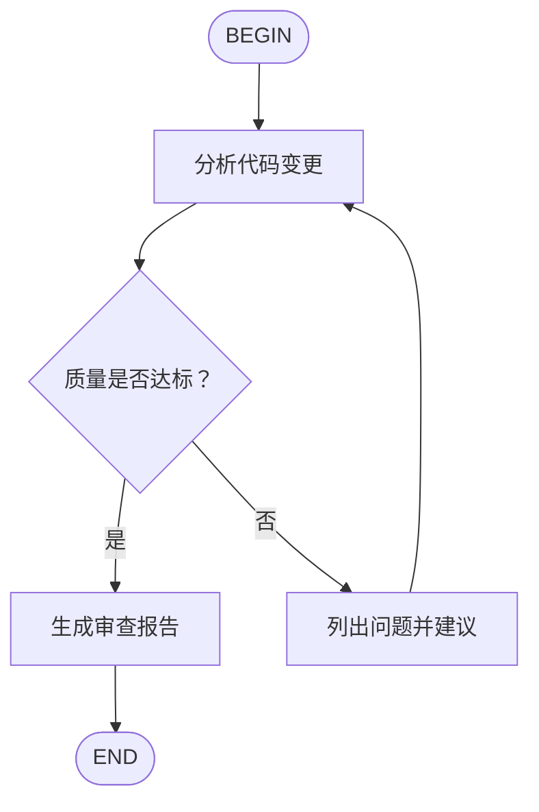

# Kimi Platform Skill

Kimi (Moonshot AI) 全平台开发指南。适用于使用 Kimi Code CLI 进行 AI 辅助开发、
调用 Kimi API 构建应用、以及使用 kimi-datasource 插件查询 A 股/港股行情。

## When to Use This Skill

- 使用 Kimi Code CLI（`kimi` 命令）进行交互式开发、代码修改、项目探索
- 需要了解 Agent / 子 Agent 的工作机制与最佳实践
- 需要安装/使用/开发插件（Plugin）或 MCP 服务器
- 需要了解 Skills 的发现机制与创建方法
- 需要了解斜杠命令、会话管理、Print 模式等高级用法
- 使用 Kimi API（kimi-k2.6 / kimi-latest）开发应用或 Agent
- 实现 Tool Calls（工具调用）功能
- 使用 `kimi-datasource` 插件查询 A 股/港股实时行情与技术指标
- 处理流式响应（Streaming）
- 调试工具调用相关的错误

---

## 第一部分：Kimi Code CLI 核心能力

### 1.1 安装与启动

```bash
# 安装（自动安装 uv + kimi-cli）
curl -LsSf https://code.kimi.com/install.sh | bash

# 或已有 uv 时
uv tool install --python 3.13 kimi-cli

# 验证安装
kimi --version

# 启动交互式对话
cd your-project && kimi

# 启动 Web UI
kimi web

# 以 ACP 服务方式运行（供 IDE 集成）
kimi acp
```

**首次运行**：执行 `/login` 配置 API 来源。推荐选择 Kimi Code 平台（OAuth 授权）。

**常用命令速查**：

| 命令 | 说明 |
|------|------|
| `kimi` | 启动交互式对话 |
| `kimi web` | 打开浏览器图形界面 |
| `kimi acp` | 启动 ACP 服务器（IDE 集成） |
| `/login` | 配置或切换 API 来源 |
| `/usage` | 查看剩余额度和配额 |
| `/help` | 查看所有命令和快捷键 |
| `/init` | 分析项目并生成 AGENTS.md |
| `/skill:<name>` | 加载指定 Skill |
| `/flow:<name>` | 执行 Flow Skill 工作流 |
| `Ctrl-J` | 换行（不提交） |
| `Ctrl-C / Ctrl-D` | 中断 / 退出 |

### 1.2 完整 CLI 参数与调用方式

#### 启动参数总览

```bash
# 基础启动
kimi

# 指定工作目录
kimi --work-dir /path/to/project
kimi -w /path/to/project

# 添加额外目录到工作区（可多次指定）
kimi --add-dir /path/to/shared-lib --add-dir /path/to/assets

# 指定模型
kimi --model kimi-k2.6
kimi -m kimi-for-coding

# 会话管理
kimi --continue                    # 继续当前目录最近会话
kimi -C
kimi --session                     # 交互式选择会话
kimi -r abc123                     # 恢复指定会话
kimi -S abc123

# 非交互式执行（Print 模式）
kimi --print -p "列出所有 Python 文件"
kimi --quiet -p "生成 commit message"

# 审批控制
kimi --yolo                        # 自动批准所有操作
kimi -y
kimi --afk                         # 无人值守模式（自动 dismiss 提问）

# Plan 模式
kimi --plan                        # 以 Plan 模式启动

# Thinking 模式
kimi --thinking
kimi --no-thinking

# Agent 配置
kimi --agent okabe                 # 使用内置 okabe Agent
kimi --agent-file ./my-agent.yaml  # 加载自定义 Agent

# MCP 配置
kimi --mcp-config-file ./mcp.json
kimi --mcp-config '{"mcpServers": {...}}'

# Skills 配置
kimi --skills-dir /path/to/skills

# 循环控制
kimi --max-steps-per-turn 200
kimi --max-retries-per-step 5

# 配置覆盖
kimi --config-file /path/to/config.toml
kimi --config '{"default_model": "kimi-k2"}'

# 调试
kimi --verbose
kimi --debug
```

#### 子命令

```bash
# 账号管理
kimi login                         # 登录（OAuth 或 API Key）
kimi logout                        # 登出

# 信息查看
kimi info                          # 版本和协议信息
kimi --version                     # 仅版本号

# MCP 管理
kimi mcp add --transport http myserver https://...
kimi mcp add --transport stdio mylocal -- npx my-mcp@latest
kimi mcp list
kimi mcp test myserver
kimi mcp remove myserver
kimi mcp auth myserver             # OAuth 授权

# 插件管理
kimi plugin install /path/to/plugin
kimi plugin install https://example.com/plugin.zip
kimi plugin install https://github.com/user/repo.git
kimi plugin list
kimi plugin info my-plugin
kimi plugin remove my-plugin

# 会话导出
kimi export                        # 导出当前会话为 ZIP
kimi export abc123 -o ~/backup.zip --yes

# Web UI
kimi web --port 8080 --host 0.0.0.0 --no-open
kimi web --network                 # 监听所有接口，显示局域网 IP

# 可视化追踪（Agent Tracing Visualizer）
kimi vis --port 5495 --open
kimi vis --network --reload        # 开发模式，监听所有接口

# Toad TUI（终端 UI，实验性）
kimi term
```

### 1.3 Agent 与子 Agent

#### 内置 Agent

启动时通过 `--agent` 参数选择：

| Agent | 说明 | 额外工具 |
|-------|------|---------|
| `default` | 默认 Agent，适合通常情况 | — |
| `okabe` | 实验性 Agent | `SendDMail` |

```bash
kimi --agent okabe
```

#### 自定义 Agent 文件（YAML）

通过 `--agent-file` 加载自定义 Agent：

```yaml
# my-agent.yaml
version: 1
agent:
  name: my-agent
  system_prompt_path: ./system.md
  tools:
    - "kimi_cli.tools.shell:Shell"
    - "kimi_cli.tools.file:ReadFile"
    - "kimi_cli.tools.file:WriteFile"
```

**继承与覆盖**：

```yaml
version: 1
agent:
  extend: default  # 继承默认 Agent
  system_prompt_path: ./my-prompt.md
  exclude_tools:
    - "kimi_cli.tools.web:SearchWeb"
```

**关键字段**：

| 字段 | 说明 |
|------|------|
| `extend` | 继承的 Agent，可以是 `default` 或相对路径 |
| `name` | Agent 名称 |
| `system_prompt_path` | 系统提示词文件路径（相对于 Agent 文件） |
| `system_prompt_args` | 自定义参数，支持 `${VAR}` 模板语法 |
| `tools` | 工具列表，格式 `模块:类名` |
| `exclude_tools` | 要排除的工具 |
| `subagents` | 子 Agent 定义 |

**系统提示词内置变量**：

| 变量 | 说明 |
|------|------|
| `${KIMI_NOW}` | 当前时间（ISO 格式） |
| `${KIMI_WORK_DIR}` | 工作目录路径 |
| `${KIMI_WORK_DIR_LS}` | 工作目录文件列表 |
| `${KIMI_AGENTS_MD}` | 合并后的 AGENTS.md 内容 |
| `${KIMI_SKILLS}` | 加载的 Skills 列表 |
| `${KIMI_ADDITIONAL_DIRS_INFO}` | `--add-dir` 添加的额外目录信息 |

#### 子 Agent

子 Agent 处理特定类型的任务，通过 `Agent` 工具启动。

**在 Agent 文件中定义子 Agent**：

```yaml
version: 1
agent:
  extend: default
  subagents:
    coder:
      path: ./coder-sub.yaml
      description: "处理编码任务"
    reviewer:
      path: ./reviewer-sub.yaml
      description: "代码审查专家"
```

子 Agent 文件通常继承主 Agent：

```yaml
# coder-sub.yaml
version: 1
agent:
  extend: ./agent.yaml
  system_prompt_args:
    ROLE_ADDITIONAL: |
      你现在作为子 Agent 运行...
```

**三种内置子 Agent 类型**：

| 类型 | 用途 | 可用工具 |
|------|------|---------|
| `coder` | 通用软件工程 | Shell、ReadFile、Glob、Grep、WriteFile、StrReplaceFile、SearchWeb、FetchURL |
| `explore` | 快速只读代码探索 | 同上，但**无写入工具** |
| `plan` | 实现规划与架构设计 | ReadFile、Glob、Grep、SearchWeb、FetchURL（**无 Shell、无写入**） |

**子 Agent 运行方式**：

- 通过 `Agent` 工具启动，在独立上下文中运行
- 每个实例在 `subagents/<agent_id>/` 下维护独立上下文历史
- 支持多次 `resume` 恢复继续使用
- **子 Agent 不能嵌套使用 `Agent` 工具**（仅根 Agent 可用）
- 支持 `run_in_background=true` 后台运行

**`Agent` 工具参数**：

| 参数 | 说明 |
|------|------|
| `description` | 任务简短描述（3-5 词） |
| `prompt` | 任务详细描述 |
| `subagent_type` | 内置类型：`coder`（默认）/`explore`/`plan` |
| `model` | 可选模型覆盖 |
| `resume` | 恢复已有实例 ID |
| `run_in_background` | 后台运行，默认 false |
| `timeout` | 超时秒数（30-3600），前台默认无限制 |

**使用建议**：
- 需要搜索代码库 → `explore`（只读，安全）
- 需要设计方案 → `plan`（无 Shell，专注分析）
- 需要写代码 → `coder`
- 多个独立问题 → 并行启动多个子 Agent
- 需要保留上下文 → 使用 `resume` 恢复同一实例

**示例：并行使用多个子 Agent**

```
# 同时让两个子 Agent 分别探索不同模块
Agent(description="探索 auth 模块", prompt="阅读 src/auth/ 目录下所有文件，总结认证流程", subagent_type="explore")
Agent(description="探索 api 模块", prompt="阅读 src/api/ 目录下所有文件，总结 API 设计", subagent_type="explore")

# 等两个都完成后，基于它们的总结做整合分析
```

**示例：后台运行子 Agent**

```
# 启动一个耗时的后台分析任务
Agent(
  description="运行全量测试",
  prompt="运行 pytest 并分析失败的测试用例，给出修复建议",
  subagent_type="coder",
  run_in_background=true
)

# 主 Agent 继续处理其他工作，任务完成后自动收到通知
```

---

## 第二部分：斜杠命令完整参考

斜杠命令以 `/` 开头，在交互式 Shell 中输入触发。

### 帮助与信息

| 命令 | 功能 | 示例 |
|------|------|------|
| `/help` | 显示帮助、快捷键、Skills 列表 | `/help` |
| `/version` | 显示版本号 | `/version` |
| `/changelog` | 显示变更记录 | `/changelog` |
| `/feedback` | 提交反馈 | `/feedback` |

### 账号与配置

| 命令 | 功能 | 示例 |
|------|------|------|
| `/login` | 登录/配置 API 平台 | `/login` |
| `/logout` | 登出当前平台 | `/logout` |
| `/model` | 切换模型和 Thinking 模式 | `/model` |
| `/editor` | 设置外部编辑器 | `/editor vim` |
| `/theme` | 切换主题（dark/light） | `/theme light` |
| `/reload` | 重新加载配置 | `/reload` |
| `/debug` | 显示上下文调试信息 | `/debug` |
| `/usage` | 显示 API 用量和配额 | `/usage` |
| `/mcp` | 显示已连接的 MCP 服务器 | `/mcp` |
| `/hooks` | 显示已配置的 hooks | `/hooks` |

### 会话管理

| 命令 | 功能 | 示例 |
|------|------|------|
| `/new` | 创建新会话 | `/new` |
| `/sessions` | 列出并切换会话 | `/sessions` |
| `/title` | 查看/设置会话标题 | `/title 修复登录 Bug` |
| `/undo` | 回退到某轮次重试 | `/undo` |
| `/fork` | 复制当前会话分支 | `/fork` |
| `/export` | 导出会话为 Markdown | `/export ~/session.md` |
| `/import` | 从文件/会话导入上下文 | `/import ./prev.md` |
| `/clear` | 清空当前会话上下文 | `/clear` |
| `/compact` | 手动压缩上下文 | `/compact 保留数据库讨论` |

### Skills 与工作区

| 命令 | 功能 | 示例 |
|------|------|------|
| `/skill:<name>` | 加载指定 Skill | `/skill:code-style` |
| `/flow:<name>` | 执行 Flow Skill | `/flow:code-review` |
| `/add-dir` | 添加额外目录到工作区 | `/add-dir /path/to/lib` |

### 运行控制

| 命令 | 功能 | 示例 |
|------|------|------|
| `/yolo` | 切换 YOLO 模式（自动审批） | `/yolo` |
| `/afk` | 切换 AFK 模式（无人值守） | `/afk` |
| `/plan` | 切换/管理 Plan 模式 | `/plan on` |
| `/task` | 打开任务浏览器 | `/task` |
| `/btw` | 侧问（不中断主对话） | `/btw 这个函数的作用是什么` |
| `/web` | 切换到 Web UI | `/web` |
| `/vis` | 切换到追踪可视化 | `/vis` |
| `/init` | 生成 AGENTS.md | `/init` |

### 模式切换快捷键

| 快捷键 | 功能 |
|--------|------|
| `Ctrl-X` | 切换 Agent/Shell 模式 |
| `Shift-Tab` | 切换 Plan 模式 |
| `Ctrl-O` | 在外部编辑器中编辑 |
| `Ctrl-J` / `Alt-Enter` | 插入换行 |
| `Ctrl-S` | Steer：streaming 期间立即注入消息 |
| `Ctrl-V` | 粘贴（支持文本/图片/视频） |
| `Ctrl-E` | 展开审批请求完整内容 |
| `1`–`3` | 审批面板快速选择 |
| `1`–`5` | 问题面板按编号选择选项 |
| `Ctrl-D` | 退出 |
| `Ctrl-C` | 中断当前操作 |

---

## 第三部分：会话管理与状态持久化

### 续接会话

```bash
# 继续当前目录最近会话
kimi --continue

# 交互式选择会话
kimi --session

# 恢复指定会话
kimi -r <session-id>

# 运行中切换
/sessions
```

**退出时的续接提示**：
```
To resume this session: kimi -r <session-id>
```

### 会话状态持久化

恢复会话时自动还原：
- **审批决策**：YOLO/AFK 状态、"本会话允许"的批准记录
- **Plan 模式**：开关状态
- **子 Agent 实例**：上下文历史和状态
- **额外目录**：`--add-dir` 或 `/add-dir` 添加的目录

### 导出与导入

```
# 导出当前会话
/export
/export ~/exports/my-session.md

# 从文件导入
/import ./previous-export.md

# 从其他会话导入
/import abc12345
```

### 上下文压缩

```
# 手动压缩（保留关键信息，减少 token）
/compact
/compact 保留数据库相关的讨论
```

---

## 第四部分：交互模式详解

### Agent 模式 vs Shell 模式

- **Agent 模式**（默认）：输入发送给 AI 处理，提示符 `✨`
- **Shell 模式**：直接执行 Shell 命令，提示符 `$`
- 按 `Ctrl-X` 切换

Shell 模式支持部分斜杠命令：`/help`、`/exit`、`/version`、`/editor`、`/changelog`、`/feedback`、`/export`、`/import`、`/task`。

> **注意**：Shell 模式中每个命令独立执行，`cd`、`export` 等不影响后续命令。

### Plan 模式

Plan 模式下 AI 只能使用只读工具，将方案写入 plan 文件后提交审批。

**进入方式**：
1. 启动参数：`kimi --plan`
2. 快捷键：`Shift-Tab`
3. 斜杠命令：`/plan` 或 `/plan on`
4. AI 主动触发：`EnterPlanMode` 工具请求

**审批选项**：
- **批准执行**：选择具体实施路径（多路径时）或 Approve
- **Reject**：拒绝，保持 Plan 模式，提供反馈
- **Reject and Exit**：拒绝并退出 Plan 模式
- **Revise**：输入修改意见，AI 修订后重新提交

**管理命令**：
```
/plan        # 切换开关
/plan on     # 开启
/plan off    # 关闭
/plan view   # 查看当前方案
/plan clear  # 清除方案文件
```

### Thinking 模式

让 AI 在回答前进行更深入思考。

```bash
kimi --thinking
kimi --no-thinking
```

或通过 `/model` 命令交互式切换。

### 运行中发送消息

- **排队（Enter）**：消息放入队列，当前轮次完成后自动发送
- **立即注入（Ctrl+S）**：消息立即注入到正在运行的轮次上下文中

### 后台任务

AI 使用 `Shell` 或 `Agent` 工具的 `run_in_background=true` 启动后台任务。

```
# 查看任务状态
/task

# 任务浏览器快捷键
Enter / O    # 查看完整输出
S            # 请求停止任务
Tab          # 切换过滤模式
R            # 刷新
Q / Esc      # 退出
```

默认最多 4 个并发后台任务，可在 `config.toml` 的 `[background]` 中调整。

### 审批机制

| 操作 | 审批要求 |
|------|---------|
| Shell 命令执行 | 每次执行 |
| 文件写入/编辑 | 每次操作 |
| MCP 工具调用 | 每次调用 |
| 停止后台任务 | 每次停止 |

**审批选项**：
- **允许**：执行这次操作
- **本会话允许**：当前会话自动批准同类操作（持久化）
- **拒绝**：不执行
- **附带反馈拒绝**：拒绝并输入反馈指导 Agent

### YOLO 模式 vs AFK 模式

| | YOLO | AFK |
|--|------|-----|
| 自动审批 | ✅ | ✅ |
| 自动 dismiss AskUserQuestion | ❌ | ✅ |
| 适用场景 | 人在场，减少确认摩擦 | 人离开，完全自动 |
| 状态栏标识 | 黄色 YOLO | 橙色 AFK |
| 启动方式 | `kimi --yolo` / `/yolo` | `kimi --afk` / `/afk` |

> **1.40.0 重要变更**：YOLO 与 AFK 已拆分为两个正交模式。YOLO 仅绕过权限审批，不再向模型注入"非交互模式"的系统提示，模型仍可通过 `AskUserQuestion` 触达用户；AFK 才表示用户已离开，会自动 dismiss 提问。`/yolo` 与 `/afk` 各自独立切换，互不干扰。`--print` 模式现在使用 AFK 行为而非 YOLO。

---

## 第五部分：Print 模式（非交互式）

Print 模式适合脚本调用和自动化场景。

### 基本用法

```bash
# 传入指令，执行后自动退出
kimi --print -p "列出当前目录的所有 Python 文件"
kimi --print --command "检查代码风格"

# 通过 stdin 传入
echo "解释这段代码的作用" | kimi --print
```

**特点**：非交互、隐式启用 `--afk`、文本输出到 stdout。

### 退出与后台任务

`--print` 模式下进程会等待后台 Agent 任务完成后再退出（默认上限 1 小时，由 `print_wait_ceiling_s` 控制），而不是直接杀死它们。超时后会向模型提供最后一次总结机会再退出。如需保留后台任务，在配置中设置 `keep_alive_on_exit = true`。

### 仅输出最终结果

```bash
# 跳过中间工具调用过程，只输出最终消息
kimi --print -p "生成 commit message" --final-message-only

# --quiet 是快捷方式
kimi --quiet -p "生成 commit message"
```

### JSON 格式（程序化集成）

```bash
# JSONL 输出
kimi --print -p "你好" --output-format=stream-json

# JSON 输入 + JSON 输出
echo '{"role":"user","content":"你好"}' | kimi --print --input-format=stream-json --output-format=stream-json
```

**Message 格式**：

```json
// User 消息
{"role": "user", "content": "你的问题"}

// Assistant 消息（带工具调用）
{
  "role": "assistant",
  "content": "让我执行这个命令。",
  "tool_calls": [
    {
      "type": "function",
      "id": "tc_1",
      "function": {
        "name": "Shell",
        "arguments": "{\"command\":\"ls\"}"
      }
    }
  ]
}

// Tool 消息
{"role": "tool", "tool_call_id": "tc_1", "content": "file1.py\nfile2.py"}
```

### 退出码

| 退出码 | 含义 | 说明 |
|--------|------|------|
| `0` | 成功 | 任务正常完成 |
| `1` | 失败（不可重试） | 配置错误、认证失败、额度用尽 |
| `75` | 失败（可重试） | 429 限速、5xx 错误、连接超时 |

**CI/CD 集成示例**：

```bash
kimi --print -p "检查 src/ 目录下是否有明显的安全问题，输出 JSON 格式的报告"
code=$?
if [ $code -eq 75 ]; then
  echo "暂时性错误，稍后重试..."
  sleep 10
  kimi --print -p "检查安全问题"
elif [ $code -ne 0 ]; then
  echo "不可恢复错误，退出码: $code"
  exit $code
fi
```

**批量处理示例**：

```bash
for file in src/*.py; do
  kimi --quiet -p "为 $file 添加类型注解"
done
```

---

## 第六部分：插件（Plugin）与 MCP

### 6.1 插件系统（Beta）

插件是轻量级本地工具包，通过 `plugin.json` 声明可执行工具，AI 可直接调用。

**与 MCP 的区别**：

| | 插件 | MCP |
|--|------|-----|
| 定位 | 轻量级本地脚本 | 持续运行的服务 |
| 配置 | `plugin.json` | `mcp.json` |
| 通信 | 本地进程（stdin/stdout） | stdio / HTTP / SSE |
| 适用场景 | 项目特定工具、快速原型 | 复杂编排、跨进程通信 |

**插件管理命令**：

```bash
# 安装插件（本地目录 / 本地 ZIP / ZIP URL / Git 仓库）
kimi plugin install /path/to/my-plugin
kimi plugin install my-plugin.zip
kimi plugin install https://example.com/my-plugin.zip
kimi plugin install https://github.com/user/repo.git
kimi plugin install https://github.com/user/repo.git/plugins/my-plugin
# 自 1.41.0 起支持直接从 GitHub/GitLab archive ZIP 链接安装：
kimi plugin install https://github.com/user/repo/archive/refs/heads/main.zip

# 列出 / 查看 / 移除
kimi plugin list
kimi plugin info my-plugin
kimi plugin remove my-plugin
```

**`plugin.json` 结构**：

```json
{
  "name": "my-plugin",
  "version": "1.0.0",
  "description": "...",
  "config_file": "config.json",
  "inject": {
    "llm.api_key": "api_key",
    "llm.endpoint": "base_url"
  },
  "tools": [
    {
      "name": "tool_name",
      "description": "工具描述",
      "command": ["python3", "scripts/tool.py"],
      "parameters": {
        "type": "object",
        "properties": {
          "arg": {"type": "string", "description": "参数说明"}
        },
        "required": ["arg"]
      }
    }
  ]
}
```

**工具脚本规范**：
- 从 `stdin` 接收 JSON 参数
- 向 `stdout` 输出结果（建议 JSON 格式）
- 向 `stderr` 输出错误，非 0 退出码表示失败

**凭证注入**：通过 `inject` 配置自动获取 Kimi Code CLI 的 API 密钥和 base URL，注入到插件的 `config.json` 中。切换提供商或重新授权后，重启 kimi-cli 即可自动刷新。

**完整插件开发示例**：

```python
#!/usr/bin/env python3
# scripts/greet.py
import json
import sys

params = json.load(sys.stdin)
name = params.get("name", "Guest")
lang = params.get("lang", "zh")

greetings = {"zh": f"你好，{name}！", "en": f"Hello, {name}!", "ja": f"こんにちは、{name}さん！"}
result = {"content": greetings.get(lang, greetings["zh"])}
print(json.dumps(result))
```

```json
{
  "name": "greet-plugin",
  "version": "1.0.0",
  "description": "多语言问候插件",
  "tools": [
    {
      "name": "greet",
      "description": "生成问候语",
      "command": ["python3", "scripts/greet.py"],
      "parameters": {
        "type": "object",
        "properties": {
          "name": {"type": "string", "description": "姓名"},
          "lang": {"type": "string", "enum": ["zh", "en", "ja"], "description": "语言"}
        },
        "required": ["name"]
      }
    }
  ]
}
```

### 6.2 MCP 服务器

MCP 是开放协议，让 AI 安全地与外部工具和数据源交互。

**管理命令**：

```bash
# 添加 HTTP 服务器
kimi mcp add --transport http context7 https://mcp.context7.com/mcp
kimi mcp add --transport http --header "KEY: value" myserver https://...
kimi mcp add --transport http --auth oauth linear https://mcp.linear.app/mcp

# 添加 stdio 服务器
kimi mcp add --transport stdio chrome-devtools -- npx chrome-devtools-mcp@latest

# 列出 / 测试 / 移除 / 授权 / 重置授权
kimi mcp list
kimi mcp test context7
kimi mcp remove context7
kimi mcp auth linear
kimi mcp reset-auth linear    # 清除 OAuth 缓存令牌
```

**配置文件** `~/.kimi/mcp.json`：

```json
{
  "mcpServers": {
    "context7": {
      "url": "https://mcp.context7.com/mcp",
      "headers": {"CONTEXT7_API_KEY": "your-key"}
    },
    "local": {
      "command": "npx",
      "args": ["chrome-devtools-mcp@latest"],
      "env": {"SOME_VAR": "value"}
    }
  }
}
```

**临时加载**：

```bash
kimi --mcp-config-file /path/to/mcp.json
kimi --mcp-config '{"mcpServers": {...}}'
```

---

## 第七部分：kimi-datasource 插件详解

`kimi-datasource` 是官方股票数据源插件，提供 A 股/港股实时行情查询工具 `query_stock`。

### 7.1 安装与确认

```bash
kimi plugin install https://cdn.kimi.com/kimi-code-plugins/kimi-datasource.zip
kimi plugin info kimi-datasource
```

### 7.2 query_stock 工具

**参数**：

| 参数 | 必填 | 说明 |
|------|:---:|------|
| `ticker` | ✅ | 股票代码，逗号分隔，一次最多 **3 个**。例：`600519.SH` 或 `600519.SH,0700.HK` |
| `type` | | 查询类型，默认 `realtime_price` |
| `file_path` | | CSV 输出路径，不传自动生成到 `/tmp/` |
| `time` | | 查询时刻 `YYYY-MM-DD HH:MM:SS`（秒必须是 `00`），**大多数情况不传** |

**四种查询类型**：

| `type` | A股 | 港股 | 返回内容 |
|--------|:---:|:---:|---------|
| `realtime_price` | ✅ | ⚠️ 仅限交易时段 | 最新价 + 分钟 K 线（`ts_code, time, open, close, high, low, vol, amount, pct_change, pct_change_1m`） |
| `realtime_tech` | ✅ | ❌ | 技术指标（`KDJ, OBV, BOLL, MA, EXPMA, MACD, LB, ROC, BBI, CCI, RSI, ATR`） |
| `open_summary` | ✅ | ✅ | 开盘摘要（`close, thscode, time`） |
| `close_summary` | ✅ | ✅ | 收盘摘要（`pre_close, open, high, low, close, vwap, chg, pct_chg, volume, amt, turn`） |

> **港股盘后查当天数据必须用 `close_summary`**；`realtime_price` 收盘后拿不到数据。  
> **港股不支持 `realtime_tech`**，调用会报错。

### 7.3 支持范围

| 市场 | 后缀 | 支持 |
|------|------|:---:|
| A 股 上交所 | `.SH` | ✅ |
| A 股 深交所 | `.SZ` | ✅ |
| A 股 北交所 | `.BJ` | ✅ |
| 港股 | `.HK` | ✅（技术指标除外） |
| 美股 | — | ❌ |
| ETF / 指数 / 基金 | — | ❌（返回 `No realtime data available`） |

### 7.4 使用规范

**1. 调用前必须核对股票代码**  
千万不要凭记忆猜代码和后缀。用户说中文名时，先用联网搜索确认正确代码和后缀。

**2. 一次最多 3 个 ticker**，超过分批调用。

**3. 混合 A 股 + 港股查询时**，CSV 会自动拆成两个文件：
- 传 `file_path="/tmp/mix.csv"` → 实际生成 `/tmp/mix_a.csv`（A 股）和 `/tmp/mix_hk.csv`（港股）
- 原路径文件本身不存在

**4. 返回处理**：
- stdout 打印摘要文字（含 `data_preview`，前两行数据）
- 完整数据写入 CSV 文件
- 简单问题用 `data_preview` 回答；复杂分析用 `ReadFile` 读 CSV

### 7.5 常见场景与完整示例

**场景 1：查当前价**
```
# 步骤：
# 1. 搜索核对 → 600519.SH
# 2. 调用 query_stock
query_stock(ticker="600519.SH", type="realtime_price")
# 3. 从返回的 data_preview 拿 close 和 pct_change
# 4. 中文回答用户："贵州茅台当前价 XXX 元，涨跌幅 X.XX%"
```

**场景 2：查技术指标（A 股）**
```
# 步骤：
# 1. 搜索核对 → 600519.SH
# 2. 调用 query_stock
query_stock(ticker="600519.SH", type="realtime_tech")
# 3. 返回 MA/MACD/KDJ/RSI/BOLL/CCI/BBI/LB/ATR 等
# 4. 做多空判断：
#    - MACD DIFF>DEA → 金叉
#    - KDJ J>80 → 超买，J<20 → 超卖
#    - RSI>70 → 超买，<30 → 超卖
# 5. 中文回答并带免责声明
```

**场景 3：查港股收盘**
```
# 港股、问收盘 → 必须用 close_summary
# 1. 搜索核对 → 0700.HK
# 2. 调用 query_stock
query_stock(ticker="0700.HK", type="close_summary")
# 3. 返回 pre_close, open, high, low, close, vwap, chg, pct_chg, volume, amt, turn
```

**场景 4：多股对比（最多 3 只）**
```
# 三只一次调用
query_stock(ticker="600519.SH,000858.SZ,000568.SZ", type="realtime_price")
# 四只以上拆两次调用再合并结果
```

**场景 5：自选股管理**
```
# 1. 读 ~/.kimi/plugins/kimi-datasource/watchlist.json
# 2. 按每 3 只一组分批调 query_stock
# 3. 汇总报告
# 4. 有 hold_cost/hold_quantity 的算盈亏：
#    盈亏 = (当前价 - hold_cost) × hold_quantity
```

**watchlist.json 格式**：

```json
[
  {"code": "600519.SH", "name": "贵州茅台"},
  {"code": "0700.HK", "name": "腾讯控股", "hold_cost": 350.5, "hold_quantity": 100}
]
```

**场景 6：添加自选股**
```
# 1. 搜索核对代码
# 2. 追加到 watchlist.json
```

**场景 7/8：不支持的品种**
```
# 指数/ETF/基金/美股 → 直接告诉用户：
# "当前数据源不支持指数和 ETF 的实时查询，只能查个股（A 股 / 港股）。"
# "当前数据源不支持美股。"
```

### 7.6 故障排查

| 现象 | 原因 | 解决 |
|------|------|------|
| "找不到 Kimi 凭证文件" | 未登录 | 运行 `kimi login` |
| `No realtime data available` | 非交易时段查 `realtime_price` | 改用 `close_summary` 或等开盘 |
| `PARAMETER_ERROR - realtime_tech is not supported for HK stocks` | 港股用了 `realtime_tech` | 换成 `realtime_price` 或 `close_summary` |

---

## 第八部分：Kimi 开放平台 API

### 8.1 安装 SDK

```bash
pip install openai  # Kimi API 兼容 OpenAI SDK
```

### 8.2 基础调用

```python
from openai import OpenAI

client = OpenAI(
    api_key="YOUR_KIMI_API_KEY",
    base_url="https://api.kimi.com/v1"
)

completion = client.chat.completions.create(
    model="kimi-k2.6",
    messages=[
        {"role": "system", "content": "你是 Kimi"},
        {"role": "user", "content": "你好"}
    ]
)
print(completion.choices[0].message.content)
```

### 8.3 模型列表

| 模型名 | 说明 |
|--------|------|
| `kimi-k2.6` | Kimi K2.6，最新版本，Agent 能力强，支持 Thinking 模式 |
| `kimi-k2-thinking` | K2 Thinking 系列，始终处于 Thinking 模式（不可关闭） |
| `kimi-k2-thinking-turbo` | Thinking 模式轻量版，速度更快 |
| `kimi-latest` | 始终指向最新版本 |
| `kimi-for-coding` | Claude Code 兼容版本 |

### 8.4 工具调用（Tool Calls）

```python
tools = [{
    "type": "function",
    "function": {
        "name": "get_stock_price",
        "description": "获取股票价格",
        "parameters": {
            "type": "object",
            "properties": {
                "code": {"type": "string", "description": "股票代码"}
            },
            "required": ["code"]
        }
    }
}]

completion = client.chat.completions.create(
    model="kimi-k2.6",
    messages=messages,
    tools=tools
)
```

**工具调用执行循环（非流式）**：

```python
import json

def get_stock_price(code):
    return {"code": code, "price": 100.0}

tool_map = {"get_stock_price": get_stock_price}
messages = [{"role": "user", "content": "查询 603019 的股价"}]

while True:
    completion = client.chat.completions.create(
        model="kimi-k2.6", messages=messages, tools=tools
    )
    choice = completion.choices[0]

    if choice.finish_reason == "tool_calls":
        messages.append(choice.message)
        for tc in choice.message.tool_calls:
            result = tool_map[tc.function.name](json.loads(tc.function.arguments))
            messages.append({
                "role": "tool",
                "tool_call_id": tc.id,
                "name": tc.function.name,
                "content": json.dumps(result)
            })
    else:
        print(choice.message.content)
        break
```

**流式调用检测工具调用**：

```python
# 流式响应中通过 delta.tool_calls 检测工具调用
for chunk in stream:
    delta = chunk.choices[0].delta
    if delta.tool_calls:
        # 收集工具调用参数
        for tc in delta.tool_calls:
            # tc.function.name / tc.function.arguments
            pass
```

### 8.5 在 Claude Code 中使用 Kimi API

当前环境已通过 `ANTHROPIC_BASE_URL=https://api.kimi.com/coding/` 配置使用 Kimi 模型。
如需独立调用 Kimi API（如使用原生工具调用），需单独初始化 OpenAI 客户端指向 `https://api.kimi.com/v1`。

### 8.6 环境变量

| 环境变量 | 说明 |
|----------|------|
| `KIMI_MODEL_THINKING_KEEP` | 启用 Preserved Thinking（如设为 `all`），让支持该功能的模型（`kimi-k2.6`、`kimi-k2-thinking` 等）在多轮之间保留历史 `reasoning_content`。注意会显著增加输入 token 与费用。 |

---

## 第九部分：Skills 机制

### 9.1 Skills 发现机制

分层加载，同名时越具体优先：**Project > User > Extra > Built-in**

**用户级 Skills 目录**（品牌组互斥选一 + 通用组互斥选一，合并加载）：

- 品牌组：`~/.kimi/skills/` > `~/.claude/skills/` > `~/.codex/skills/`
- 通用组：`~/.config/agents/skills/`（推荐）> `~/.agents/skills/`

**项目级 Skills 目录**（先向上查找最近的 `.git` 祖先目录作为项目根，再在其下搜索）：

- 品牌组：`.kimi/skills/` > `.claude/skills/` > `.codex/skills/`
- 通用组：`.agents/skills/`

> 找不到 `.git` 时回退到工作目录本身，避免误入无关上层目录。

**配置项**：

```toml
# ~/.kimi/config.toml
merge_all_available_skills = true   # 合并所有存在的品牌目录（默认 true）
extra_skill_dirs = [
    "~/my-skills-collection",
    ".claude/plugins/my-skills",
    "/opt/team-shared/skills"
]
```

> `merge_all_available_skills` 默认值自 1.39.0 起从 `false` 改为 `true`，会自动合并用户级和项目级所有品牌目录的 Skills。如需旧行为，显式设为 `false`。

**命令行覆盖**：

```bash
# 替代自动发现
kimi --skills-dir /path/to/my-skills

# 追加（配合 extra_skill_dirs 配置）
```

### 9.2 创建 Skill

两种方式：

**方式一：目录结构（推荐）**

创建目录 `my-skill/` + 编写 `SKILL.md`：

```markdown
---
name: my-skill
description: 我的项目规范
---

## 规范内容
...
```

**方式二：扁平单文件**

直接将 `my-skill.md` 放入 Skills 目录：

```markdown
---
name: my-skill
description: 我的项目规范
---

## 规范内容
...
```

> 扁平 `.md` 文件名默认作为 Skill 名称（frontmatter 中显式写了 `name:` 时以 frontmatter 为准）。同目录下子目录与扁平文件同名时，以子目录为准。

**Frontmatter 字段**：

| 字段 | 说明 |
|------|------|
| `name` | 1-64 字符，小写字母/数字/连字符 |
| `description` | 1-1024 字符，说明用途和场景 |
| `license` | 许可证 |
| `compatibility` | 环境要求 |
| `metadata` | 额外键值对 |

**最佳实践**：
- 保持 `SKILL.md` 在 500 行以内
- 详细内容移到 `scripts/`、`references/`、`assets/`
- 使用相对路径引用其他文件
- 提供清晰的步骤指引、输入输出示例、边界情况说明

### 9.3 Flow Skills

特殊 Skill 类型，内嵌流程图定义多步骤自动化工作流。

```markdown
---
name: code-review
description: 代码审查工作流
type: flow
---


```

**调用方式**：
- `/flow:code-review` — 按流程图自动执行多轮对话
- `/skill:code-review` — 作为普通 Skill 加载（不执行流程）

---

## 第十部分：配置与进阶

### 10.1 配置文件完整参考

主配置：`~/.kimi/config.toml`

```toml
# 基础设置
default_model = "kimi-for-coding"
default_thinking = false
default_yolo = false
skip_afk_prompt_injection = false
default_plan_mode = false
default_editor = ""
theme = "dark"
show_thinking_stream = true
merge_all_available_skills = true

# 供应商配置
[providers.kimi-for-coding]
type = "kimi"
base_url = "https://api.kimi.com/coding/v1"
api_key = "sk-xxx"

# 模型配置
[models.kimi-for-coding]
provider = "kimi-for-coding"
model = "kimi-for-coding"
max_context_size = 262144

# 循环控制
[loop_control]
max_steps_per_turn = 1000
max_retries_per_step = 3
max_ralph_iterations = 0
reserved_context_size = 50000
compaction_trigger_ratio = 0.85

# 后台任务
[background]
max_running_tasks = 4
keep_alive_on_exit = false
agent_task_timeout_s = 900
print_wait_ceiling_s = 3600

# 外部服务（/login 选择 Kimi Code 时自动配置）
[services.moonshot_search]
base_url = "https://api.kimi.com/coding/v1/search"
api_key = "sk-xxx"

[services.moonshot_fetch]
base_url = "https://api.kimi.com/coding/v1/fetch"
api_key = "sk-xxx"

# MCP 客户端
[mcp.client]
tool_call_timeout_ms = 60000

# Hooks（Beta）
[[hooks]]
event = "PreToolUse"
matcher = "Shell"
command = ".kimi/hooks/safety-check.sh"
timeout = 10
```

### 10.2 配置项详解

| 配置项 | 类型 | 默认值 | 说明 |
|--------|------|--------|------|
| `default_model` | string | — | 默认模型，必须在 `models` 中定义 |
| `default_thinking` | bool | false | 默认 Thinking 模式 |
| `default_yolo` | bool | false | 默认 YOLO 模式 |
| `default_plan_mode` | bool | false | 默认 Plan 模式 |
| `theme` | string | "dark" | 终端主题（dark/light） |
| `show_thinking_stream` | bool | true | 实时展示思考文本 |
| `merge_all_available_skills` | bool | true | 合并所有品牌目录的 Skills |
| `max_steps_per_turn` | int | 1000 | 单轮最大步数 |
| `max_retries_per_step` | int | 3 | 单步最大重试次数 |
| `compaction_trigger_ratio` | float | 0.85 | 自动压缩触发阈值 |
| `max_running_tasks` | int | 4 | 最大并发后台任务 |
| `keep_alive_on_exit` | bool | false | 退出时保留后台任务 |
| `agent_task_timeout_s` | int | 900 | 后台 Agent 任务超时 |
| `print_wait_ceiling_s` | int | 3600 | Print 模式等待后台任务上限（秒） |
| `skip_afk_prompt_injection` | bool | false | 抑制 AFK 模式下注入的系统提示词 |

### 10.3 供应商类型

| 类型 | 说明 | 示例平台 |
|------|------|---------|
| `kimi` | Kimi API | Kimi Code, Moonshot AI |
| `openai_legacy` | OpenAI Chat Completions | OpenAI, 兼容服务 |
| `openai_responses` | OpenAI Responses API | OpenAI |
| `anthropic` | Anthropic Claude API | Claude |
| `gemini` | Google Gemini API | Gemini |
| `vertexai` | Google Vertex AI | Vertex AI |

所有供应商类型都支持通过 `custom_headers` 字段添加自定义 HTTP 请求头：

```toml
[providers.my-provider]
type = "openai_legacy"
base_url = "https://api.example.com/v1"
api_key = "sk-xxx"
custom_headers = {"X-Custom-Header": "value"}
```

### 10.4 模型能力

| 能力 | 说明 |
|------|------|
| `thinking` | 支持 Thinking 模式（可开关） |
| `always_thinking` | 始终 Thinking（不可关闭） |
| `image_in` | 支持图片输入 |
| `video_in` | 支持视频输入 |

```toml
[models.gemini-3-pro-preview]
provider = "gemini"
model = "gemini-3-pro-preview"
max_context_size = 262144
capabilities = ["thinking", "image_in"]
```

### 10.5 重要注意事项

- **工具调用时模型只返回参数，实际执行必须由开发者代码完成**
- **每个 `tool_call` 必须有对应的 `role="tool"` 消息，且 `tool_call_id` 必须匹配**
- **子 Agent 不能嵌套使用 `Agent` 工具**
- **流式调用时通过 `delta.tool_calls` 检测工具调用**
- **工具定义会占用上下文窗口 token**
- **MCP 工具调用也需要用户审批（YOLO/AFK 模式下自动批准）**
- **插件安装位置**：`~/.kimi/plugins/`
- **Shell 模式中 `cd`、`export` 不影响后续命令**
- **YOLO 模式下 `EnterPlanMode` 自动通过，但 `ExitPlanMode` 仍需审批**
- **AFK 模式下 Plan 模式的进入和退出都自动批准**

---

## 第十一部分：Hooks 系统（Beta）

Hooks 让你在 Agent 生命周期关键节点执行自定义命令，实现自动化工作流、安全检查、通知提醒等功能。

> ⚠️ Hooks 目前处于 Beta 阶段，配置定义可能在未来版本中调整。

### 11.1 支持的事件

| 事件 | 触发时机 | Matcher 过滤 | 可用上下文 |
|------|----------|--------------|------------|
| `PreToolUse` | 工具调用前 | 工具名称 | `tool_name`, `tool_input`, `tool_call_id` |
| `PostToolUse` | 工具成功执行后 | 工具名称 | `tool_name`, `tool_input`, `tool_output` |
| `PostToolUseFailure` | 工具执行失败后 | 工具名称 | `tool_name`, `tool_input`, `error` |
| `UserPromptSubmit` | 用户提交输入前 | 无 | `prompt` |
| `Stop` | Agent 轮次结束时 | 无 | `stop_hook_active` |
| `StopFailure` | 轮次因错误结束时 | 错误类型 | `error_type`, `error_message` |
| `SessionStart` | 会话创建/恢复时 | 来源 | `source` |
| `SessionEnd` | 会话关闭时 | 原因 | `reason` |
| `SubagentStart` | 子 Agent 启动时 | Agent 名称 | `agent_name`, `prompt` |
| `SubagentStop` | 子 Agent 结束时 | Agent 名称 | `agent_name`, `response` |
| `PreCompact` | 上下文压缩前 | 触发原因 | `trigger`, `token_count` |
| `PostCompact` | 上下文压缩后 | 触发原因 | `trigger`, `estimated_token_count` |
| `Notification` | 通知发送到 sink 时 | sink 名称 | `sink`, `notification_type`, `title`, `body`, `severity` |

### 11.2 配置方式

在 `~/.kimi/config.toml` 中使用 `[[hooks]]` 数组定义：

```toml
# 文件编辑后自动格式化
[[hooks]]
event = "PostToolUse"
matcher = "WriteFile|StrReplaceFile"
command = "jq -r '.tool_input.file_path' | xargs prettier --write"

# 阻止修改 .env 文件
[[hooks]]
event = "PreToolUse"
matcher = "WriteFile|StrReplaceFile"
command = ".kimi/hooks/protect-env.sh"
timeout = 10

# 需要审批时发送桌面通知
[[hooks]]
event = "Notification"
matcher = "permission_prompt"
command = "osascript -e 'display notification \"Kimi needs attention\" with title \"Kimi CLI\"'"
```

**配置字段**：

| 字段 | 必填 | 默认值 | 说明 |
|------|:---:|--------|------|
| `event` | ✅ | — | 事件类型 |
| `command` | ✅ | — | 执行的 shell 命令，通过 stdin 接收 JSON 上下文 |
| `matcher` | — | `""` | 正则表达式过滤，空字符串匹配所有 |
| `timeout` | — | `30` | 超时秒数，超时后按 fail-open 处理 |

### 11.3 通信协议

**输入（stdin）**：JSON 格式上下文，包含 `session_id`、`cwd`、`hook_event_name` 及事件特定字段。

**输出（退出码）**：

| 退出码 | 行为 |
|--------|------|
| `0` | 允许继续，stdout 内容（非空时）添加到上下文 |
| `2` | 阻止操作，stderr 反馈给 LLM 作为修正建议 |
| 其他 | 允许继续，stderr 仅记录日志 |

**结构化 JSON 输出**（退出码 0 时）：

```json
{
  "hookSpecificOutput": {
    "hookEventName": "PreToolUse",
    "permissionDecision": "deny",
    "permissionDecisionReason": "请使用 rg 代替 grep"
  }
}
```

当 `permissionDecision` 为 `deny` 时，会阻止操作并将原因反馈给 LLM。

---

## 第十二部分：Wire 模式

Wire 模式将 Kimi Code CLI 的底层 JSON-RPC 通信协议暴露给外部程序，用于构建自定义 UI 或将 CLI 嵌入其他应用。

### 12.1 启动方式

```bash
kimi --wire
```

> 仅需简单非交互输入输出时，使用 Print 模式更简单。Wire 模式适合需要完整控制和双向通信的场景。

### 12.2 协议概述

基于 JSON-RPC 2.0，通过 stdin/stdout 进行双向通信。当前协议版本 `1.9`。每条消息为一行 JSON。

**核心消息类型**：

| 类型 | 说明 |
|------|------|
| `initialize` | Client → Agent 握手，协商协议版本、提交外部工具定义 |
| `prompt` | Client → Agent 发送用户输入 |
| `tool_call` | Agent → Client 请求执行工具 |
| `tool_result` | Client → Agent 返回工具执行结果 |
| `question` | Agent → Client 请求用户回答（如 AskUserQuestion） |
| `message` | Agent → Client 发送文本/思考/thinking 等内容 |

### 12.3 典型用途

- **自定义 UI**：构建 Web、桌面或移动端前端
- **应用集成**：将 Kimi Code CLI 嵌入其他应用程序
- **自动化测试**：对 Agent 行为进行程序化测试

---

## Resources

- Kimi 开放平台：https://platform.kimi.com
- 工具调用文档：https://platform.kimi.com/docs/guide/use-kimi-api-to-complete-tool-calls
- Agent 搭建文档：https://platform.kimi.com/docs/guide/use-kimi-k2-to-setup-agent
- Kimi CLI 文档：https://moonshotai.github.io/kimi-cli/
- LLM 友好版文档：https://moonshotai.github.io/kimi-cli/llms.txt
- GitHub：https://github.com/MoonshotAI/kimi-cli
